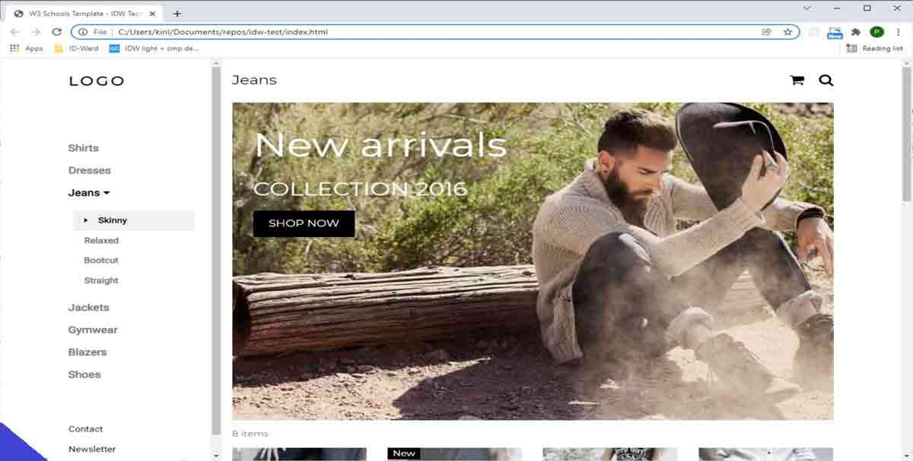

### To prepare this run:
```
npm i
gulp
```
---
# "Simple technical task"

Providing you folder with three files: **_index.html_**, **_collect.js_**, and **_plugin.js_**. At the bottom of the index.html page, you can see the script is added:
```
<script
    src="plugin.js"
    isRunning="true">
</script>
```
All the functionality should be implemented inside the plugin.js and collect.js files. Do not modify index.html


You can add some extra files if you consider that it is needed (extracting some functionality, styles, etc.)

You can use whatever tech stack you would like. We want to see how you approach the foundations of a project.

---

## The task:

```plugin.js```
- If the script's "_isRunning_" attribute value equals "false" (isRunning="false"), the script should not do anything. Otherwise, it should implement the following functionality:
- Add the triangle button in the bottom-left corner of the page (see the image below). The triangle should always be visible and always located in the bottom-left corner of the web page.
- Clicking on the triangle should toggle the modal dialog
- The modal dialog should be a simple box with two buttons: "Accept" and "Reject". It should be shown over the website and should be responsive to resizing.
- Block scrolling and click interactions on the website while the modal is shown.
- The modal dialog should follow the same look and feel as the rest of the page (try using the same styles).
- Clicking the Reject button should close the modal and unblock the website (allow the user the scroll and interact with the site)
- Clicking the Accept button should do the same as clicking "Reject" but also dynamically add the collect.js script to the HTML page
- Pay attention that plugin.js contains the ```getUserId()``` function, which mimics the obtaining of the user ID. This userId should be passed into the ```collect.js``` (see below what collect.js should do with userId)
- Make sure the ```collect.js``` script is added only **once**
- The user’s choice (Accepted or Rejected) should be persisted somewhere - so if you refresh the page after the "Accept" has already been clicked, the ```collect.js``` script should be added without the need to click “Accept” once again 

```collect.js:```
- when the web page is about to unload, POST the following data(see the JSON example below) to this URL https://putsreq.herokuapp.com/ylG2esx9EkW77PmdnsUI

```
{
    "userId": {user ID obtained from the plugin.js}
    "date": {actual date}
    "url": {current page url}
    "uag": {info about user's browser (in random format)}
    "uag_lang": {language of the user's browser}
    "location": {Country AND/OR City of current user}
}
```



